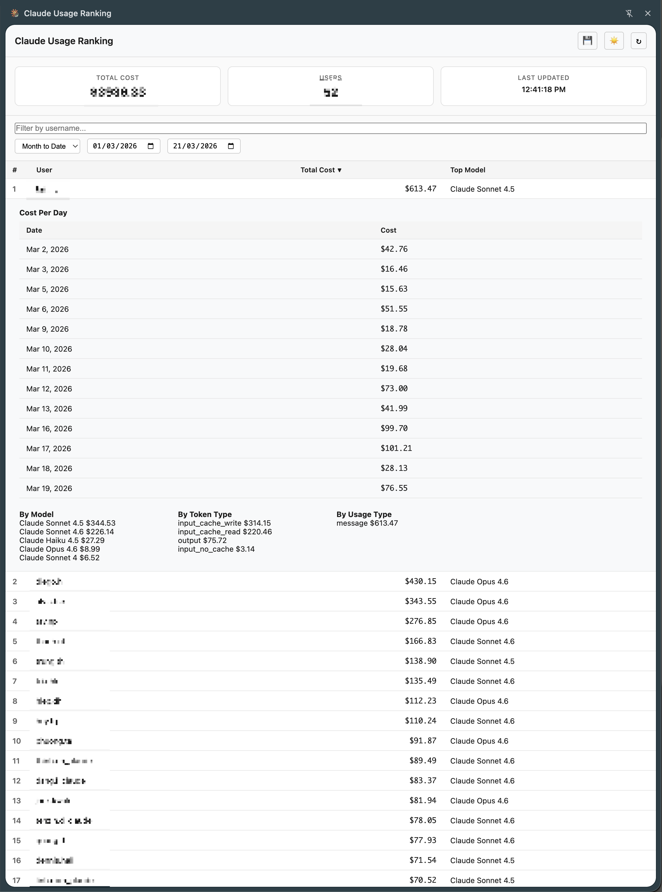

# Claude Usage Ranking

A Chrome extension that tracks and ranks Claude API usage costs per user within your organization's workspace. View costs by user, model, token type, and date — all from a convenient side panel.



## Why

The Claude Console shows aggregate usage, but doesn't rank individual users by cost. This extension directly calls the Claude usage API and presents a ranked leaderboard so you can quickly see who's spending what.

## Features

- **User cost ranking** — sorted leaderboard of all users by total spend
- **Filter by username** — search and filter users by name to quickly find specific team members
- **Date range presets** — Month to Date, Today, Yesterday, Last 7/30 Days, Last Month, or Custom
- **Per-user breakdown** — click a user to see cost per day, model, token type, and usage type
- **Direct API fetching** — calls the Claude usage API directly using your existing browser session. Your session cookie is never stored, collected, or sent anywhere outside of `platform.claude.com` — all requests stay between your browser and Anthropic's servers
- **Smart incremental caching** — only fetches missing dates, always refreshes today for latest costs. For example, if you previously fetched 7 days and then switch to 8 days with cache enabled, only day 8 and today are fetched — the rest comes from cache
- **Cache toggle** — switch between cached (fast) and fresh (always re-fetch) modes
- **Dark/light/auto theme** — matches your system preference or toggle manually
- **Platform sync** — changing the date filter on Claude platform auto-syncs to the side panel
- **Side panel UI** — stays open alongside any page after first activation

## How It Works

1. Visit the Claude Console cost page once (`platform.claude.com/.../cost`) to activate
2. The extension reads your org/workspace IDs from that page — these stay in your local browser storage only
3. After activation, the extension calls the usage API on your behalf using your existing session — no credentials are extracted, stored, or transmitted to any third party
4. Data is cached locally per-date — past dates are stored in your browser, today always re-fetches
5. Results are displayed in a Chrome side panel with search, sort, presets, and date filtering

## Install

### From source (developer mode)

1. Clone this repo:
   ```bash
   git clone https://github.com/cs-ventures/cc-ranking.git
   ```

2. Open Chrome and go to `chrome://extensions/`

3. Enable **Developer mode** (toggle in top right)

4. Click **Load unpacked** and select the `src/` folder

5. Navigate to [platform.claude.com](https://platform.claude.com) and open the cost page (one-time activation)

6. Click the extension icon to open the side panel — data fetches automatically

### Updating

Pull latest changes and click the reload button on `chrome://extensions/`.

## Permissions

| Permission | Reason |
|---|---|
| `storage` | Cache usage data and settings locally in your browser |
| `cookies` | Read your existing session cookie to authenticate API calls — never stored or shared |
| `sidePanel` | Display ranking UI in Chrome side panel |
| `tabs` | Detect active tab for platform URL sync |
| `host_permissions: platform.claude.com` | Scope all API calls strictly to `platform.claude.com` — no other domains are accessed |

## Project Structure

```
src/
├── manifest.json            # Extension manifest v3
├── service-worker.js        # API fetching, caching, data processing
├── content-script.js        # Bridge: relays IDs and URL changes to service worker
├── injected-script.js       # Reads org/workspace IDs from page, monitors URL changes
├── icons/                   # Extension icons
├── lib/
│   ├── data-processor.js    # Usage data processing utilities
│   ├── storage-manager.js   # Chrome storage helpers
│   └── username-extractor.js # Extract usernames from API key names
└── sidepanel/
    ├── sidepanel.html       # Side panel markup
    ├── sidepanel.css        # Styling with dark/light theme
    └── sidepanel.js         # UI controller with preset date ranges
```

## License

MIT
